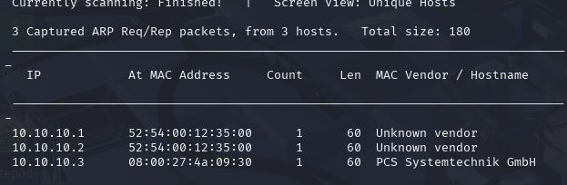
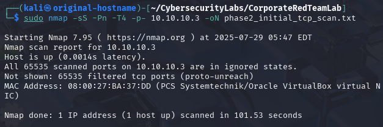

   

# 🛡️ Corporate Red Team Simulation Lab

Welcome to the **Corporate Red Team Simulation Lab** — a hands-on project inspired by the mindset and methodology of real-world adversaries. This initiative showcases my passion as a **Cybersecurity Ethical Hacker & Penetration Tester**, blending offensive security tools, creativity, and strategy to simulate attacks against a virtual corporate environment.

## 🎯 Objective

To emulate advanced persistent threat (APT) behavior in a lab setup using **Kali Linux**, custom scripts, and open-source tools — following a full red team lifecycle:
1. Reconnaissance
2. Initial Access
3. Privilege Escalation
4. Lateral Movement
5. Exfiltration
6. Reporting and Remediation Suggestions

---

## 🔍 Lab Tools & Environment

| Component        | Details                            |
|------------------|-------------------------------------|
| Offensive OS     | Kali Linux (Rolling)                |
| Targets          | Metasploitable 2, Windows 10, DVWA  |
| C2 Framework     | Empire, Covenant, or Metasploit     |
| Enumeration      | Nmap, Enum4linux, Nikto             |
| Custom Scripts   | Bash, Python                        |
| Reporting Tools  | CherryTree, Markdown, LibreOffice   |

---

## 📁 Project Structure


---

## 📸 Screenshots & Demonstrations

Will be added as the lab progresses to showcase:
- Exploit results
- Enumeration output
- Lateral movement techniques
- Credential harvesting
- Exfiltration strategies

---

## 📖 Write-Ups

| Phase | Description                          | Status |
|-------|--------------------------------------|--------|
| 1     | Recon & Enumeration                  | 🔄 In Progress |
| 2     | Gaining Initial Access               | ⏳ Pending |
| 3     | Privilege Escalation                 | ⏳ Pending |
| 4     | Lateral Movement                     | ⏳ Pending |
| 5     | Data Exfiltration                    | ⏳ Pending |
| 6     | Final Report + Defense Suggestions   | ⏳ Pending |
---

## 💡 Why This Lab?

This project was born out of curiosity and a desire to simulate how attackers think — so I can help defend better. It’s not about tools alone but the **thinking process**, the **chain of compromise**, and the **real-world creativity** involved in ethical hacking.

---

## 🔗 Connect With Me

- **LinkedIn**: [https://www.linkedin.com/in/cypriano-akinwunmi-33383063/](#)

---

⚠️ **DISCLAIMER**: This lab is built and tested in an isolated environment. All activities and simulations are strictly for educational and ethical purposes.
>>>>>>> 3fdc141 (Initial commit with README and folder structure)
---

## 🔍 Phase 1: Network Discovery (Netdiscover)

### 🎯 Objective
To identify active hosts on the internal network using ARP-based reconnaissance.

### 🧪 Tool Used
- `netdiscover` — for passive and active network discovery via ARP requests.

### 📡 Command Executed
```bash
sudo netdiscover -r 10.10.10.0/24
### 🖼️ Screenshot




### ✅ Findings
The following hosts were identified:
- **10.10.10.1** — MAC: 52:54:00:12:35:00 — Unknown vendor  
- **10.10.10.2** — MAC: 52:54:00:12:35:00 — Unknown vendor  
- **10.10.10.3** — MAC: 08:00:27:4a:09:30 — PCS Systemtechnik GmbH

These hosts will be further analyzed in Phase 2 for open ports and running services.
---

## 🔎 Phase 2: Port Scanning with Nmap

### 🎯 Objective
To identify open ports and services running on the discovered host `10.10.10.3`.

### 🧪 Tool Used
- `nmap` — for scanning TCP ports.

### 🧾 Command Executed
```bash
sudo nmap -sS -Pn -T4 -p- 10.10.10.3 -oN phase2_initial_tcp_scan.txt

### 🖼️ Screenshot



✅ Findings

All 65,535 TCP ports on 10.10.10.3 were filtered (i.e., blocked or dropped by firewall), indicating strict network filtering or host hardening.

    Host is up (0.0014s latency)

    MAC: 08:00:27:BA:37:DD — PCS Systemtechnik/Oracle VirtualBox virtual NIC

    All scanned ports: filtered
